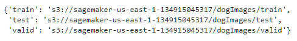
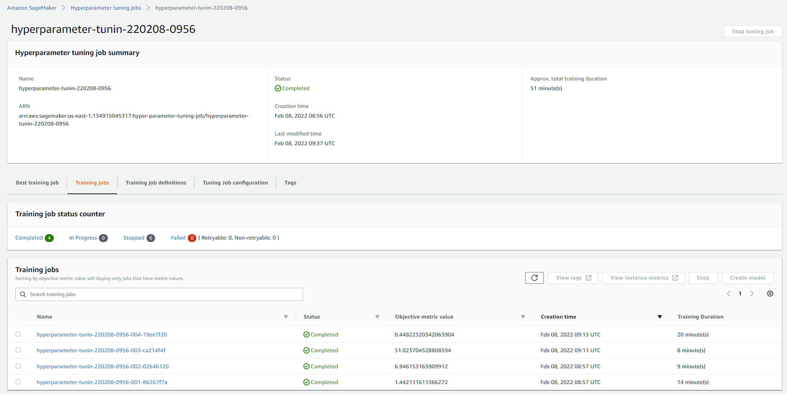
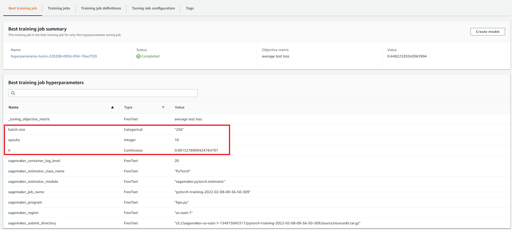
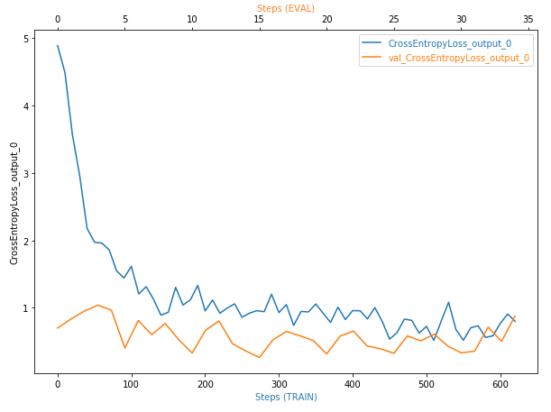
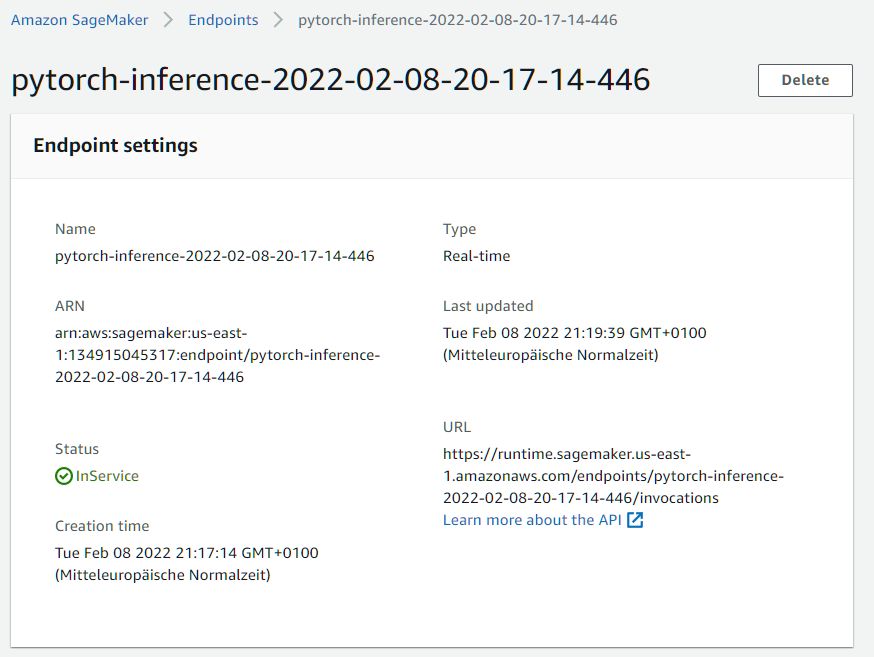
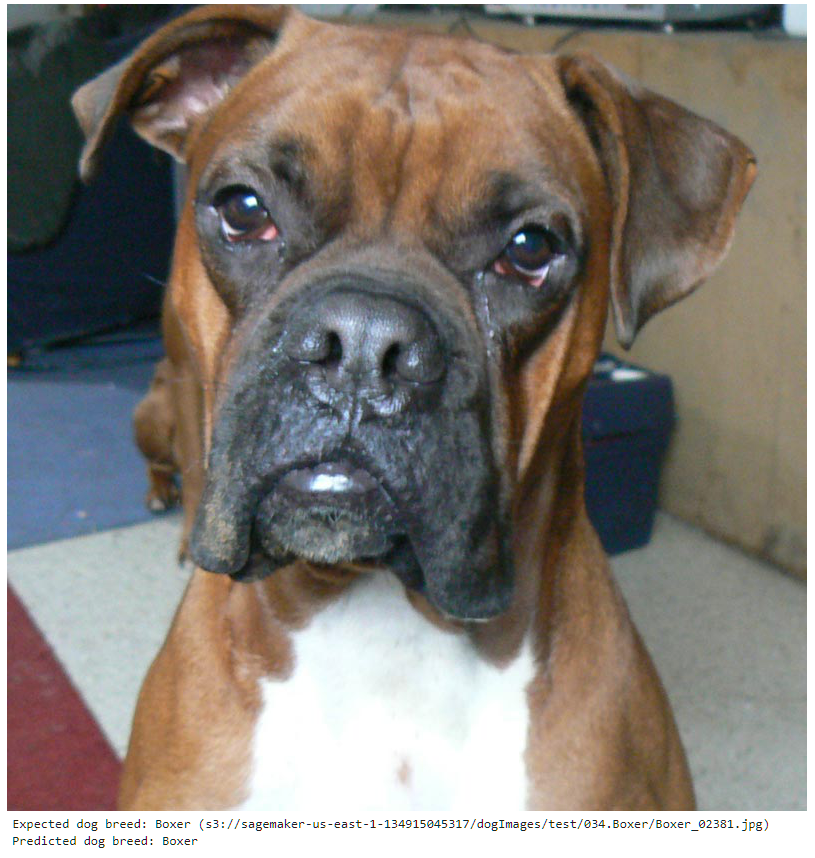

# Image Classification using AWS SageMaker

## Overview
This notebook is part of the AWS Machine Learning Engineer Nanodegree project 3 and predicts dog breeds. The images of dog breeds used to train the ResNet50 model are provided by Udacity ([dogImages.zip](https://s3-us-west-1.amazonaws.com/udacity-aind/dog-project/dogImages.zip)). The major steps are as follows:
* Prepare dataset (download, unpack, upload to S3)
* Tuning of hypterparameters
* Training a model with the best hyperparameters with debugging and profiling
* Deployment of the trained model and prediction of a sample image

The data consists of 133 dog breeds and is devided into 6.680 files for training, 835 files for validation and 836 files for testing.

## Project Setup Instructions
The only requirements is to load this repository in an AWS SageMaker instance and run the Jupyter notebook will download and upload the necessary data to S3 bucket of the SageMaker session on its own.

## Major Files
* `train_and_deploy.ipynb`: executes the main code of this project
* `hpo.py`: used as entry point for hyperparameter tuning
* `train_model.py`: used as entry point for debugging and profiling
* `inference.py`: used as entry point for deployment and predictions
 
# Milestones for executing
At first the data is downloaded and uploaded to the Sagemaker S3 bucket. You can see the the location of data in the notebook:

Then, ResNet50 model is trained with data. The range of the hyperparameters are chosen by experience:
* learning rate: 0.001 - 0.1
* batch size: 16, 64, 256, 1024
* epochs: 5 - 10

You can see the training jobs in the AWS SageMaker console:

The tuning job resulted in the following best parameters:

Using these parameters, a new model is trained with debugging and profiling enabled. The learning curve is displayed in the model:

The lines are merging at the lower level. Thus, there is no anomalous behaviour. If the lines were not merging together, the model would be overfitted and needs less training. In contrast, if the lines were merging together but at a higher point, the model would be underfitted and needs more training.

This model is used to create an end point where images can be predicted:

In the end, the notebook predicts the dog breed of a random image from the test images. As an example, here is an image of a predicted boxer:

